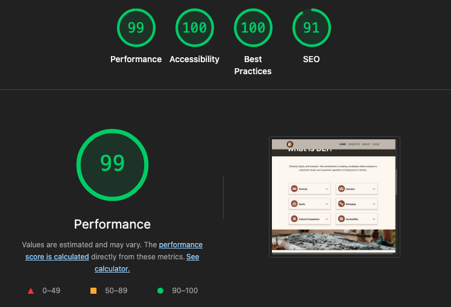

# DEI Decoded

## Introduction
"DEI Decoded" is a website designed as an accessible and beginner-friendly resource to help individuals and professionals better understand Diversity, Equity and Inclusion(DEI) in workplace and educational setttings. It aims to provide clear, beginner-friendly explanations to help grasp the core concepts of DEI, and provides practical tips and actionable strategies to help create inclusive spaces. 

The website is primarily targeted towards beginners and those seeking foundational knowledge on DEI. 
It also aims to serve professional in leadership roles or individuals and businesses looking for practical tips and actionable steps to create diverse and inclusive workspaces.

View the deployed website [dei-decoded](https://sthdinesh.github.io/dei-decoded/).

### Features of the website
- Navigation: Navigation bar for easy access to all sections.
- Hero section: Brief introduction to the site and its purpose.
- "What is DEI?" section : Clear definitions of concepts related to DEI.
- "Why is DEI important?" section : Benefits of DEI practices with statistics.
- "5 Steps to Build Inclusive Spaces" section : Guidance to implement DEI practices listed as actionable steps

### Future enhancements
- Section with tailored DEI guidance for specific contexts
- Section on DEI guidance for cross-cultural collaboration
- Section on Key Takeaways, quick checklists, resources for further reading
- FAQ section for common DEI questions
- Improvements for accessibility - Multi-language support, dark/light themes, font size adjustment

### AI Usage within the Project
AI technologies used:
- GitHub Copilot
- Microsoft Copilot

Usage:
- Planning - It was used to identify target users and user stories for the website.
- Content generation - It was used to generate the text contents within the webpage.
- Bootstrap 5 component insertion - It was used to insert Bootstrap 5 components in the codebase. This was then manually refined to meet the website needs.
- Repetitive tasks - It was used to complete repeated tasks like applying CSS styles to remaining components when one of the elements within a bootstrap component was manually styled. 
- Links/Aria labels - It was used to populate the external links with aria-labels for accessibility.
- Debug/Technical assistance- It was used to debug certain issues within the code or provide explanations HTML elements/CSS properties.
- Code generation - It was used to generate the code for footer section of the webpage. The details of the styling were then manually refined.

## User Experience Design

### Strategy Plane

#### Project goals
The primary goals of the website:
- Introduce core DEI concepts and offer practical guidance on implementation of DEI practices in easy-to-follow language
- Create a visually appealing and easy to navigate webpage with well organised content structure and visual heirarchy

The website aims to address the following User goals:
- Gain understanding of core DEI principles in workplace and educational environments
- Straightforward, easy to understand information presented in clear, well organised format
- Practical tips and actionable steps to help create diverse and inclusive spaces for all 

#### Target Users
1. New employees wanting to understand workplace culture
2. New students entering educational institutions
3. Professionals transitioning to leadership roles
4. HR professionals and educators looking for educational DEI resources to share
5. Managers, small business ownwers, community organization leaders, volunteer coordinators seeking practical implementation guidance to create inclusive work environments
6. International students workers new to specific cultural centexts
7. General public seeking personal development and interested in creating inclusive personal networks

#### User stories
1. AS A new employee or student, I WANT TO access clear definitions and basic concepts of diversity and inclusion SO THAT I CAN understand expectations and integrate successfully into my workplace or educational environment.

2. AS A manager or team leader, I WANT TO learn practical steps for creating inclusive environments SO THAT I CAN improve team dynamics and make fair decisions without extensive training resources.

3. AS An HR professional or educator, I WANT TO find easily shareable, structured DEI content SO THAT I CAN provide reliable resources during onboarding, training, or curriculum development.

4. AS A small business owner or startup founder, I WANT TO understand how to build diverse and inclusive practices from the ground up SO THAT I CAN establish positive company culture without dedicated HR departments.

5. AS An international user or remote worker, I WANT TO learn about cultural sensitivity and cross-cultural communication SO THAT I CAN adapt to local norms and collaborate effectively with diverse teams.

6. AS A community organization leader or volunteer coordinator, I WANT TO understand inclusive practices for events and programs SO THAT I CAN make activities welcoming to all community members.

7. AS ANY user accessing the site, I WANT TO easily navigate between topics and find information quickly on mobile devices SO THAT I CAN learn efficiently during limited time or while on-the-go.

8. AS A visual learner or busy professional, I WANT TO see well-organized content with clear headings and actionable tips SO THAT I CAN scan for relevant information and apply concepts immediately.

9. AS A user with accessibility needs or viewing preferences, I WANT TO adjust text size, toggle between light/dark modes, and use enhanced navigation features SO THAT I CAN access content comfortably regardless of my visual abilities or device constraints.

10. AS A new employee, manager, or professional seeking quick answers to specific DEI questions, I WANT TO access a comprehensive FAQ section with common diversity and inclusion questions and clear answers SO THAT I CAN quickly find solutions to immediate concerns without reading through extensive content and confidently address DEI situations as they arise.

### Scope Plane

#### Features

The table below includes the opportunities for the project along with a score of their importance level and viability(rated low to high, 1-5). Features that score high on importance and viability are addressed as part of the MVP. Features that score mid-range are should-have features, which will be added once the project has achieved MVP status. Low scored features are could-have features that if not addressed in this development version could be addressed in a future version.

| Feature | Importance | Viability | | Delivered |
| --- | --- | --- | --- | --- |
| Mobile-first responsive design using CSS Grid/Flexbox | 5 | 5 | must-have | &#x2611; |
| Logical section organization with visual breaks | 5 | 5 | must-have | &#x2611; |
| Sticky navigation with jump-to-section links | 5 | 5 | must-have | &#x2611; | 
| Proper ARIA labels and semantic HTML | 4 | 4 | must-have | &#x2611; |
| DEI key terms with beginner-friendly explanations | 5 | 5 | must-have | &#x2611; |
| Actionable Guide for inclusive practices | 5 | 5 | must-have | &#x2611; |
| Why DEI matters section with statistics/benefits | 4 | 5 | must-have | &#x2611; |
| Tailored DEI guidance for specific contexts  | 3 | 5 | should-have |  |
| Subtle card hovers and button interactions for UX improvement | 3 | 4 | should-have | &#x2611; |
| DEI guidance for cross-cultural collaboration  | 2 | 5 | could-have |  |
| Key Takeaways, quick checklists, resources for further reading | 2 | 5 | could-have |  |
| FAQ for common DEI questions | 1 | 5 | could-have |  |
| Accessibility - Multi-language support, dark/light themes, font size adjustment | 3 | 1 | wont-have |  | 

### Structure Plane

#### Interaction design
For user interaction, the website will include:
1. Fixed navigation bar - fully responsive for different device sizes
2. Clear section breaks with visual hierarchy
3. Vertical scroll with anchor navigation

#### Information Architecture
##### **Section 1: Hero/Introduction** 
*Priority Level 1 - Above the fold*
- **Content:** Compelling hero statement, site purpose, visual call-to-action

##### **Section 2: Core Concepts & Definitions**
*Priority Level 1 - Essential foundation*
- **Content:** 6-8 key D&I terms in accordion/card format, fundamental principles
- **Interactive Element:** Expandable definitions (Bootstrap collapse)
- **Length:** Scannable cards or 2-column layout

##### **Section 3: Why DEI Matters**
*Priority Level 1 - Business justification*
- **Content:** 3-4 key benefits with statistics, visual icons or simple graphics
- **Layout:** 3-column Bootstrap grid on desktop, stacked on mobile

##### **Section 4: Getting Started Guide**
*Priority Level 1 - Implementation focus*
- **Content:** Numbered list with actionable steps, specific examples
- **Interactive Element:** Step-by-step progression with visual indicators

##### **Section 5: Practical Applications**
*Priority Level 2 - Targeted guidance*
- **Content:** 3 tabs/columns: Workplace | Small Business | Community
- **Interactive Element:** Bootstrap tabs or accordion

##### **Section 6: Cultural Sensitivity & Communication**
*Priority Level 3 - Specialized content*
- **Content:** Key communication tips for cross-cultural collaboration, remote work considerations
- **Layout:** 2-column layout with tips and examples

##### **Section 7: Quick Reference & Resources**
*Priority Level 3 - Support materials*
- **Content:** Checklist, key points summary, further reading

### Skeleton Plane

#### Wireframes

### Surface plane

#### Colour Scheme

The website uses color palette generated using [colrmind.io](http://colormind.io/).

#### Typography

Fonts for the website are sourced from [Google Fonts](https://fonts.google.com/). [Fontjoy.com](https://fontjoy.com/) was used to view the font choices together to enure they work together.

## Technologies used

1. Languages
- HTML5
- CSS3
2. Frameworks
- Bootstrap5
3. Libraries
- [Font Awesome](https://fontawesome.com/) - used for the iconography of the website
- [Google Fonts](https://fonts.google.com/) - used for website typography
4. Programs
- Git - For version control
- GitHub - For external repository
- GitHub Pages - For deployment
- Google Chrome Dev Tools - To troubleshoot, test features and solve issues with responsiveness and styling
- [Favicon.io](https://favicon.io/) - used to generate the website favicon
- [draw.io](https://www.draw.io/) - used for creating wireframes
- [Pexels](https://www.pexels.com/) - used for sourcing free stock images for the website
- [Freeconvert](https://www.freeconvert.com/image-converter) - for file format conversion
- [Am I responsive](https://ui.dev/amiresponsive) - To create the responsive images of the website on different devices
- [Autoprefixer CSS online](https://autoprefixer.github.io/) - To parse CSS and add vendor prefixes
- [colrmind.io](http://colormind.io/) - For color palette generation

## Deployment
GitHub pages was used for the deployment of the website using the following steps:
1. Go to the repository’s [Settings > Pages](https://github.com/sthDINESH/dei-decoded/settings/pages).
3. Under “Source”, select the branch (`main`) and `/root` folder.
4. Click “Save” to enable GitHub Pages.
5. Access the deployed website via the provided [GitHub Pages URL](https://sthdinesh.github.io/dei-decoded/).

## Testing and Validation
1. HTML

[W3C Markup Validation Service](https://validator.w3.org/) was used to validate the HTML of the webpage.

2. CSS

[W3C CSS Validation Service](https://jigsaw.w3.org/css-validator/validator) was used to validate the CSS for the webpage.

3. Lighthouse
Lighthouse in Chrome Dev tools was used to assess Performance, Accessibility, Best practices and SEO.

- Desktop Test Results

- Mobile Test Results

## Credits
1. Content

Past Code Institute projects were used as inspirations for the project.
- [Welcome to Heartfelt](https://dav-noble.github.io/project-1-heartfelt/)
- [DEI](https://pezz-x.github.io/Project-1-Diversity-and-Inclusion/)

AI(GitHub Copilot and Microsoft copilot) was used to generate the content for different sections of the webpage.

Methods taught in Code Institute walkthrough projects were followed for the project completion.

2. Media

The images for the hero section and "What is DEI?" section was taken from the stock images available in [Pexels](https://www.pexels.com/).
The file format was converted using [Freeconvert](https://www.freeconvert.com/image-converter) 

3. Iconography

[Font Awesome](https://fontawesome.com/) was used to generate the icons used in the website.

